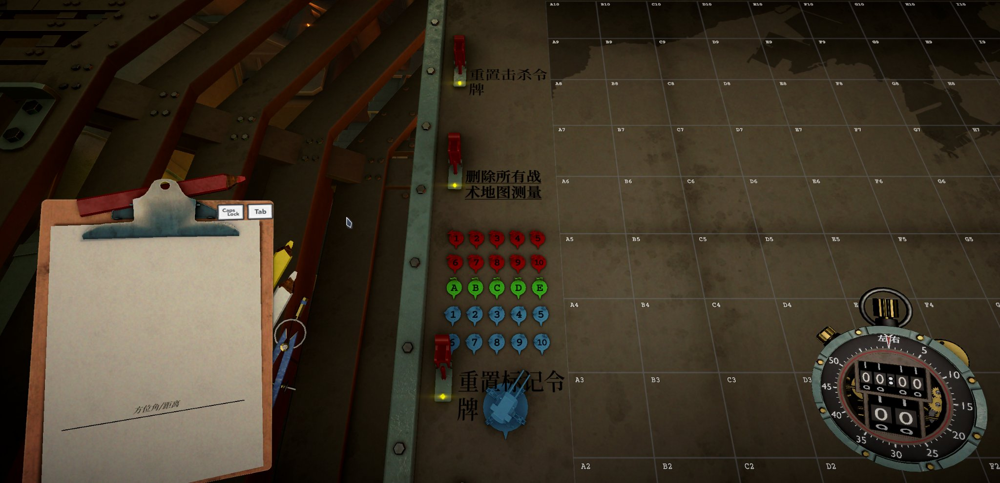
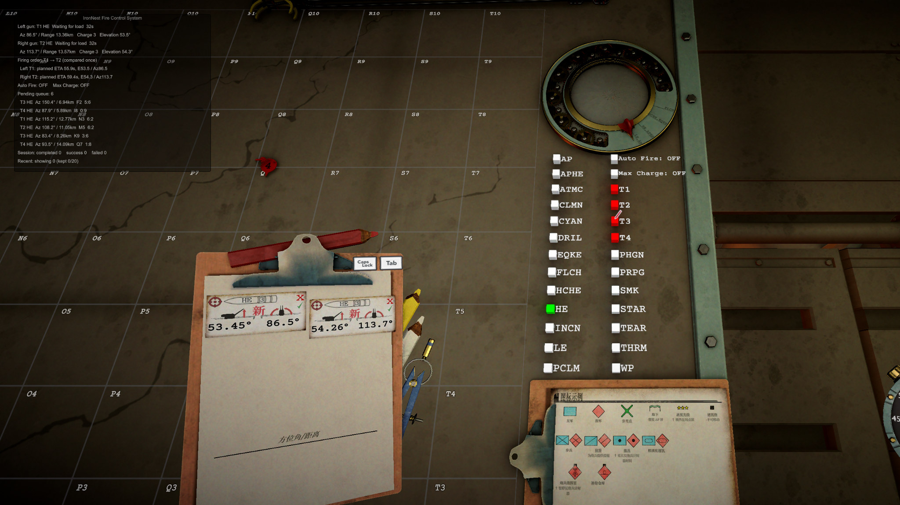

# IronNestFCS Smart

**English** | [简体中文](README.zh-CN.md)

A smart automated fire-control-system mod for **Iron Nest: Heavy Turret Simulator**.

After you place a target marker on the Tactical Map, IronNestFCS Smart can handle most of the repetitive firing workflow: ballistic calculation, gun assignment, ammunition loading, elevation, turret azimuth, trigger preparation, and optional automatic firing.

[Nexus Mods](https://www.nexusmods.com/ironnest/mods/32) · [GitHub Release](https://github.com/HisenWeb/IronNestFCS-Smart/releases/latest) · [IRON NEST on Steam](https://store.steampowered.com/app/4300500/) · [MelonLoader](https://melonwiki.xyz/)

## Design philosophy

**Automate the work, not the tactics.**

You choose the targets, ammunition, and task order. Smart executes the plan.

Press **F9** when you want to abandon the current mission plan and build a new one. F9 resets TaskSystem planning and execution state, but it does not pretend that an already accepted physical loading sequence never happened. New missions continue from the guns' real current physical state.

## Highlights

- Build a T1–T4 mission queue and keep both guns working through it.
- Replan with **F9** without erasing already-started physical loading.
- Read the real chamber, loading mechanism, turret and control state before making execution decisions.
- Calculate ballistics through the game's own ballistic calculator.
- Automatically buy missing shells and powder when required.
- Set elevation and turret azimuth automatically.
- Optional **Auto Fire** for the final firing action.
- **Max Charge** can prefer the highest usable powder charge.
- The top-left FCS panel shows the current mission, progress, range, charge, elevation and **estimated shell flight time**; flight time is available as soon as the FirePlan is created instead of waiting for the mechanical TTI dial to reach the firing-ready stage.
- The UI automatically follows the game's Chinese/English language state. If Chinese cannot be positively identified, the FCS uses English.
- One universal release package is used for all players.

## Download and installation

Download the latest universal package:

```text
IronNestFCS-Smart_vX.X.X.zip
```

Installation:

1. Install MelonLoader for IL2CPP and run the game once.
2. Close the game.
3. Extract the ZIP directly into the game root directory.
4. Allow Windows to merge `Mods`, `UserLibs`, and `UserData` when prompted.
5. Start the game normally through MelonLoader.

After installation these files should exist:

```text
<GameDir>/Mods/IronNestFCS.dll
<GameDir>/UserLibs/IronNestFCS.Abstractions.dll
<GameDir>/UserData/IronNestFCS/IronNestFCS.Logic.dll
```

Do **not** put the whole ZIP inside the `Mods` folder.

## Automatic UI language

There is no separate Chinese package, English package, or `language.txt` file.

Smart reads a localized game UI label that belongs to the left Time-To-Impact dial:

- exact Chinese label `左` → Simplified Chinese FCS UI;
- anything else, missing detection, or unsupported languages → English FCS UI.

The cached game label is rechecked periodically, so changing the game language can update the FCS UI without maintaining a separate mod-language setting.

## How to use it

### 1. Place a target marker

On the Tactical Map, move one of the red numbered markers `1–4` to the position you want to attack.



### 2. Select ammunition and submit the mission

Choose the shell type, then click the matching T1–T4 submit button:



```text
red 1 → T1
red 2 → T2
red 3 → T3
red 4 → T4
```

You can submit several missions in succession. Smart will plan and distribute them between the two guns.

### 3. Let the FCS prepare the shot

A normal mission flows through:

```text
read target
→ read current physical state
→ solve ballistics
→ choose a gun
→ buy missing ammunition if needed
→ load shell + powder
→ set elevation
→ rotate turret
→ prepare Review / Arm
→ manual fire or Auto Fire
```

### 4. Read the status panel

The top-left `IronNest Fire Control System` panel shows:

- left/right gun physical state or current T mission;
- mission progress and elapsed time;
- azimuth and range;
- charge and elevation;
- **estimated shell flight time** as soon as the FirePlan is created;
- fire-priority/order status;
- Auto Fire and Max Charge state;
- pending queue;
- session success/failure statistics and recent results.

Estimated flight time uses measured in-game C1–C6 fixed charge coefficients and the target range. This makes TTI available immediately after the FirePlan is fixed instead of waiting for `WaitingForFire`. The existing game Time-To-Impact dial reader remains as a fallback if an early estimate is unavailable. The value stored on the FirePlan does not continue counting down with the mechanical dial after firing.

### 5. Fire

- **Auto Fire ON**: Smart performs the final firing action once the gun and turret are physically ready.
- **Auto Fire OFF**: Smart prepares the shot and waits for you to fire manually.

### 6. Replan with F9

Press **F9** whenever the current plan or queue is wrong. Then reposition the markers and submit new T1–T4 missions.

Important: **F9 resets the plan, not physical reality.** An already accepted shell/powder loading sequence continues. The new plan reads the resulting real chamber, elevation and turret state.

## Diagnostics

Normal play writes only the compact `problems.log`.

For full troubleshooting diagnostics, edit:

```text
<GameDir>/UserData/IronNestFCS/diagnostics.txt
```

Set it to:

```text
on
```

and press **F9**. Detailed categorized logs are then written under:

```text
<GameDir>/UserData/IronNestFCS/Logs/
```

Set `diagnostics.txt` back to `off` and press F9 after troubleshooting.

Temporary probes used to verify TTI timing, mechanical-dial behavior, and charge coefficients during development are not included in the production branch.

## Smart architecture

Smart keeps the stable Host and persistent physical loading separate from the hot-reloadable TaskSystem/Logic layer. F9 can therefore discard and rebuild mission planning while a physical load already accepted by the Host continues to exist.

The project continues from [svr2kos2/IronNestFCS](https://github.com/svr2kos2/IronNestFCS). Smart intentionally keeps its additional automation focused on operating the existing fire-control workflow rather than choosing tactical targets for the player.

## For developers

Useful scripts:

- `tools/Deploy.ps1` — build/deploy a development copy;
- `tools/Build-ReleasePackages.ps1` — build the single universal release ZIP;
- `tools/Release.ps1` — version, build, tag and publish a release from `master`.

Development notes are available in [docs/FSC_MODULARIZATION_PLAN.md](docs/FSC_MODULARIZATION_PLAN.md).

## Credits

IronNestFCS Smart is based on [svr2kos2/IronNestFCS](https://github.com/svr2kos2/IronNestFCS). Credit for the upstream code belongs to that repository's authors and contributors.

## License

Released under the repository's [MIT License](LICENSE).
